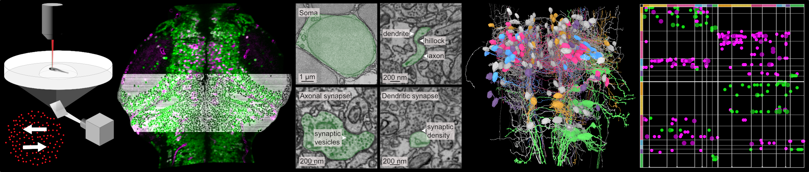

# Zebrafish Hindbrain Functional Connectomics

This repository hosts collaborative analyses on the structure–function relationships in the zebrafish hindbrain, integrating synaptic connectivity, morphology-based predictions, and network modeling.

---

## Repository Structure

### 1. Downloading neuronal morphologies and metadata

Pipeline for reconstructing and organizing neuronal morphologies, synapse positions, and connected segments from the clem_zfish1 dataset. This includes:

- Downloading and organizing meshes (nucleus, soma, axon, dendrites)  
- Exporting Neuroglancer-resolution synapse tables (8×8×30 nm)  
- Generating per-neuron metadata (IDs, reconstruction status, functional labels if available)  
- Optional extraction of ΔF/F dynamics for functionally imaged neurons  

Outputs are per-neuron folders containing:

- `*_metadata.txt` (metadata)  
- `*_axon.obj`, `*_dendrite.obj`, `*_soma.obj`, `*.obj` (meshes)  
- `*_presynapses.csv`, `*_postsynapses.csv` (synapse tables)  
- , `*_dynamics.pdf`, `*_dynamics.hdf5` (optional functional data)

**Main script:** `clem_zfish1_neuroglancer_pipeline.py`  
**Helper module:** `clem_zfish1_neuroglancer_helper.py`  
**Environment file:** `env_clem_zfish1_neuroglancer.yaml`  

---

### 2. Reference brain registration
Pipeline for registering neuronal morphologies to a standardized zebrafish reference brain coordinate framework.
 
**Environment file:** `env.yaml`

---

### 3. Connectivity Matrix Generation

Pipeline for computing and visualizing directional connectivity matrices from the **clem_zfish1** connectome.  
This step summarizes synaptic connectivity across functional neuron classes using the per-neuron synapse tables generated in Part 1.

**Includes:**
- Extraction of synaptic inputs and outputs from NG-resolution synapse tables (8×8×30 nm)  
- Automatic hemisphere classification from mapped meshes (if missing)  
- Grouping neurons into functional categories:  
  * ipsilateral_motion_integrator  
  * contralateral_motion_integrator  
  * motion_onset  
  * slow_motion_integrator  
  * myelinated  
  * axon_rostral / axon_caudal  
- Construction of two matrix types:  
  * **Pooled matrix** (across hemispheres)  
  * **Left/right-split matrix** with optional inhibitory/excitatory signed representation  
- Generation of publication-quality matrix plots (heatmap or scatter) with functional-type sidebars

**Outputs:**
- Directional connectivity matrices (pre → post synapses)  
- Pooled and L/R-split connectivity matrix PDFs  
- Optional inhibitory/excitatory signed scatter matrices  
- Summary statistics per functional category

**Main script:** `02a_make_connectivity_matrices.py`  
**Helper module:** `clem_zfish1_connectivity_helper.py`  
**Environment file:** `env_clem_zfish1_connectivity.yaml`

---

### 4. Morphology-based prediction of neuronal functional types
Includes scripts to predict functional properties (e.g., motion integrator, motion onset neurons) from morphology.

**Environment file:** `env.yaml`

---

### 5. Connectome-constrained network modeling
Computational models that simulate network dynamics under realistic connectome constraints.

**Environment file:** `env.yaml`

---
