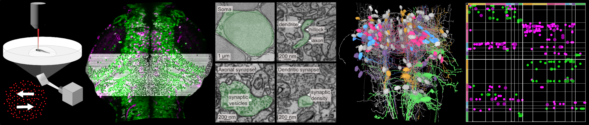

# Zebrafish Hindbrain Functional Connectomics



This repository hosts collaborative analyses on the structure–function relationships in the zebrafish hindbrain, integrating synaptic connectivity, morphology-based predictions, and network modeling.

The dataset can be visualized with Neuroglancer [here](https://spelunker.cave-explorer.org/#!middleauth+https://global.daf-apis.com/nglstate/api/v1/6294688695844864). You need to log in with a Gmail account. For more details regarding proofreading and programatic access to the dataset please visit : https://jboulanger91.github.io/fish1.5-release/

---

## Repository Structure

### 1. Downloading neuronal morphologies and metadata

Pipeline for reconstructing and organizing neuronal morphologies, synapse positions, and connected segments from the clem_zfish1 dataset. This includes:

- Downloading and organizing meshes (nucleus, soma, axon, dendrites)  
- Exporting Neuroglancer-resolution synapse tables (8×8×30 nm)  
- Generating per-neuron metadata (IDs, reconstruction status, functional labels if available)  
- Optional extraction of ΔF/F dynamics for functionally imaged neurons  

Outputs are per-neuron/axon folders containing:

- `*_metadata.txt` (metadata)  
- `*_axon.obj`, `*_dendrite.obj`, `*_soma.obj`, `*.obj` (meshes)  
- `*_presynapses.csv`, `*_postsynapses.csv` (synapse tables)  
- , `*_dynamics.pdf`, `*_dynamics.hdf5` (optional functional data)

**Main script:** `download_axons_neurons_pipeline.py`  
**Helper module:** `download_axons_neurons_helper.py`  
**Environment file:** `env_clem_zfish1_global.yaml`  

---

### 2. Reference brain registration

Pipeline for mapping neuronal morphologies and synapse coordinates from the **clem_zfish1** dataset into a standardized zebrafish reference brain. This step applies ANTs deformation fields to warp neuron meshes and synapse locations into a shared anatomical space, then generates skeletonized neuron reconstructions.

This includes:

- Mapping soma, axon, and dendrite meshes into reference space  
- Warping presynaptic and postsynaptic coordinates  
- Generating mapped OBJ meshes and synapse OBJ spheres  
- Skeletonizing neurons or axons using TEASAR  
- Healing skeleton gaps and embedding synapse node labels  
- Producing aligned SWC skeletons for further analysis  

Outputs are per-neuron folders containing:

- `*_axon_mapped.obj`, `*_dendrite_mapped.obj`, `*_soma_mapped.obj`, `*_mapped.obj` (mapped meshes)  
- `*_presynapses_mapped.csv`, `*_postsynapses_mapped.csv` (mapped synapse tables)  
- `*_presynapses_mapped.obj`, `*_postsynapses_mapped.obj` (synapse OBJ sphere files)  
- `*_mapped.swc`, `*.swc` (skeletonized neurons with synapse annotations)  

**Main script:** `register_and_skeletonize.py`  
**Helper module:** `register_and_skeletonize_cells_helpers.py`  
**Environment file:** `env_register_and_skeletonize.yaml`  

---

### 3. Connectivity Matrices and Network Diagram Generation

This folder contains the pipelines used to compute **synaptic connectivity matrices** and to generate **two-layer network diagrams** from the **clem_zfish1** zebrafish hindbrain connectome. These analyses integrate CAVE‑derived synapse tables, **registered neuron meshes**, and functional classifications.

Both pipelines require the mapped-neuron outputs generated in **Step 2 (Reference brain registration)**.

#### 3.1 Connectivity Matrices

This pipeline constructs directional **pre→post synaptic connectivity matrices** between functional/morphological neuron and axon classes.

Outputs:
- Pooled connectivity matrix (PDF)
- Left/right–split connectivity matrix (PDF)
- Left/right–split excitatory/inhibitory matrix (PDF)

**Main script:** `make_connectivity_matrices.py`  
**Helper module:** `connectivity_matrices_helper.py`  
**Environment:** `env_clem_zfish1_global.yaml`

#### 3.2 Two‑Layer Network Diagrams

This pipeline generates compact, population‑level schematic connectivity diagrams for:

- cMI — contralateral motion integrators  
- MON — motion onset neurons  
- MC/SMI — slow‑motion integrators  
- iMI+ — excitatory ipsilateral motion integrators  
- iMI− — inhibitory ipsilateral motion integrators  
- iMI_all — pooled ipsilateral motion integrators  

These diagrams require **registered neuron meshes**, because hemisphere assignment and cross‑side vs. same‑side connectivity depend on mapped spatial coordinates.

Outputs:
- One four‑panel PDF per population (ipsi/contra × inputs/outputs)
- A detailed text connectivity table per population

**Main script:** `make_connectivity_diagrams.py`  
**Helper module:** `connectivity_diagrams_helper.py`   
**Environment:** `env_clem_zfish1_global.yaml`

---

### 4. Morphology-based prediction of neuronal functional types

Pipeline for classifying neurons into four functional types (iMI, cMI, MON, SMI) from morphological features extracted from SWC skeleton tracings. Uses Linear Discriminant Analysis (LDA) with Recursive Feature Elimination (RFE) to select 13 optimal features from 68, achieving 82.1% leave-one-out cross-validation F1 score on CLEM neurons. Running with default parameters reproduces the exact results reported in the paper.

This includes:

- Extracting 68 morphological features (cable length, Strahler order, Sholl analysis, branch angles, spatial extent, etc.)
- Selecting 13 optimal features via RFE with AdaBoost
- Training LDA classifier on 120 labeled neurons (47 PA + 73 CLEM)
- Predicting functional types for 337 unlabeled neurons (215 EM + 122 CLEM)
- Verifying predictions via NBLAST morphological similarity and outlier detection
- Comparison to persistence vectors ([Li et al., 2017](https://doi.org/10.1371/journal.pcbi.1005653)) and form factors ([Choi, Kim and Hyeon, 2023](https://doi.org/10.1016/j.celrep.2023.112746))

Structural data is available on [Zenodo](https://doi.org/10.5281/zenodo.19235597) and downloaded automatically by the CLI.

```bash
python cli.py env --create        # Create environment (conda or venv)
python cli.py setup --download    # Download data from Zenodo (~116 MB)
python cli.py run                 # Train classifier and predict cell types
python cli.py all                 # Run everything end-to-end
```

**Main script:** `cli.py`
**Environment file:** `requirements.txt`

---

### 5. Connectome-constrained network modeling
Code for training and analysing a recurrent neural network that reproduces population-averaged calcium dynamics recorded bilaterally across the four neuron populations iMI, cMI, MON, and sMI in two hemispheres. The network enforces Dale's law, anatomical sparsity, and structured slow integration modes, and is fit directly to GCaMP-convolved population traces. Running with default parameters reproduces the trained connectivity and population outputs reported in the paper.

This includes:
    - The class implementing the biologically constrained RNN with signed E/I connectivity (Dale's law), block-sparse anatomical masks, and a latent "free" population of unobserved neurons (in `./model/core`)
    - The script for training via staged regularisation: spectral radius penalty on the fast connectivity and stimulus-gated hemispheric antagonism penalty (in `./model`)
    - Selection and preliminary analysis of trained models (in `./analysis`)
    - Generation of the raw version of the plots presented in Fig. 5 (in `./figures`) 

For more details about the content of the directory and its use, refer to the model-specific `README`.

**Environment file:** `./env_clem_zfish1_model.yaml`

---
